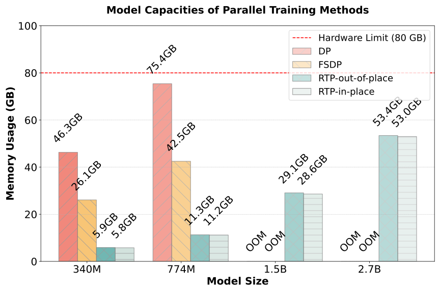

Description
====================
RTP is a PyTorch extension library for memory-efficient and large scale training.
This library is build based on [fairscale](https://github.com/facebookresearch/fairscale). 
while adding our proposed innovational Rotation Tensor Parallelism in scaling techniques.

RTP was designed with the following values in mind:

* **Memory** - RTP achieve optimal memory distribution where each worker has extractly the memory it needs without any redundancy or deduplication

* **Performance** - RTP provide the comparable performance with DP and FSDP in terms of scaling and efficiency.

Why RTP?
====================
RTP (Rotated Tensor Parallelism) is specifically designed to tackle Memory Overheads challenge, 
ensuring that large-scale models are trained efficiently without compromising on model size.

RTP stands out with its strategic focus on memory deduplication in distributed training environments. By minimizing memory duplication, RTP ensures that resources are used optimally, leading to faster and more efficient training processes.
Below is a chart representing the benchmark that was done on 8 A100 server.


RTP achieves 99% memory scaling efficiency for different llm, with 85% memory save compared with DP and 75% memory save compared with FSDP.

Installing RTP
====================

Installing RTP is extremely simple with pre-built binaries (pip) that we provide. You can also build
from source using the instructions below.


Requirements
~~~~~~~~~~~~

* PyTorch>= 1.8.1

~~~~~~~~~~~~~~~~~~~~~~

Installing from source

~~~~~~~~~~~~~~~~~~~~~~
    git clone https://github.com/wdlctc/rtp
    cd rtp
    pip install -r requirements.txt
    pip install -e .

~~~~~~~~~~~~~~~~~~~~~~
## Benchmark
~~~~~~~~~~~~~~~~~~~~~~
python benchmarks/dp_benchmark.py --use_synthetic_data
python benchmarks/fsdp_benchmark.py --use_synthetic_data
python benchmarks/tp_benchmark.py --use_synthetic_data
python benchmarks/rtp_benchmark.py --use_synthetic_data
~~~~~~~~~~~~~~~~~~~~~~
Setting for config

~~~~~~~~~~~~~~~~~~~~~~
python benchmarks/rtp_benchmark.py \
    --max_batch 10 \
    --use_synthetic_data \
    --vocab_size 10240 \
    --ninp 2048 \
    --nhid 2048 \
    --nhead 32 \
    --num_decoder_layers 10 \
    --seq_len 32 \
    --batch_size 32 
~~~~~~~~~~~~~~~~~~~~~~

Model Config arguments:
* --vocab_size: The size of the vocabulary. This typically refers to the number of unique words or tokens in your dataset. A model will have an embedding layer that maps each token in the vocabulary to a vector, and the size of this layer is determined by the vocabulary size.

* --ninp: The dimension of the input embeddings. This is the size of the vector representation for each token after it's passed through the embedding layer.

* --nhid: The dimension of the feedforward network model in the transformer encoder. In the transformer architecture, there's a feedforward neural network at the core of the encoder. This argument specifies the size of the hidden layer in that network.

* --nhead: The number of heads in the multihead attention mechanism of the transformer. Multihead attention allows the model to focus on different parts of the input for different tasks or reasons, and each "head" is a separate attention mechanism.

* --dropout: The dropout rate. Dropout is a regularization technique where, during training, random subsets of features are zeroed out to prevent overfitting.

* --initrange: The range for initializing model weights. Typically, weights in neural networks are initialized with small random values, and this argument specifies the range for those random values.

* --clip_value: The value for gradient clipping. During training, if the gradients (which are used to update the model weights) are too large, they can be "clipped" to a maximum value to prevent unstable training dynamics.

* --num_decoder_layers: The number of layers in the decoder part of the transformer. The transformer architecture has both an encoder and a decoder, and this specifies how many layers the decoder has.

* --seq_len: The length of the input sequences. This is the number of tokens that the model expects in a single input sequence.

Benchmark Config arguments:
* --epochs: The number of epochs for training. An epoch is one complete forward and backward pass of all the training examples.

* --lr: The learning rate for the optimizer. This determines the step size at each iteration while moving towards a minimum of the loss function.

* --batch_size: The number of training examples utilized in one iteration. The model weights are updated after each batch.

## Testing

~~~~~~~~~~~~~~~~~~~~~~
python -m torch.distributed.launch --nproc_per_node=2 tests/test_linear.py 
python -m torch.distributed.launch --nproc_per_node=2 tests/test_embedding.py 
python -m torch.distributed.launch --nproc_per_node=2 tests/test_attention.py 
python -m torch.distributed.launch --nproc_per_node=2 tests/test_moe.py 
python -m torch.distributed.launch --nproc_per_node=2 tests/test_transformer.py 
~~~~~~~~~~~~~~~~~~~~~~

## Citing RTP

If you use RTP in your publication, please cite it by using the following BibTeX entry.

```BibTeX
@Misc{RTP2023,
  author =       {{RTP authors}},
  title =        {RTP: Rethinking Tensor Parallelism with Memory Deduplication },
  howpublished = {\url{https://github.com/wdlctc/rtp}},
  year =         {2023}
}
```

## License

rtp.module refers [Megatron-LM](https://github.com/NVIDIA/Megatron-LM), Copyright 2020, NVIDIA CORPORATION, licensed under [Apache License](http://www.apache.org/licenses/LICENSE-2.0).

rtp.inplace.module refers [Megatron-LM](https://github.com/NVIDIA/Megatron-LM), Copyright 2020, NVIDIA CORPORATION, licensed under [Apache License](http://www.apache.org/licenses/LICENSE-2.0).
