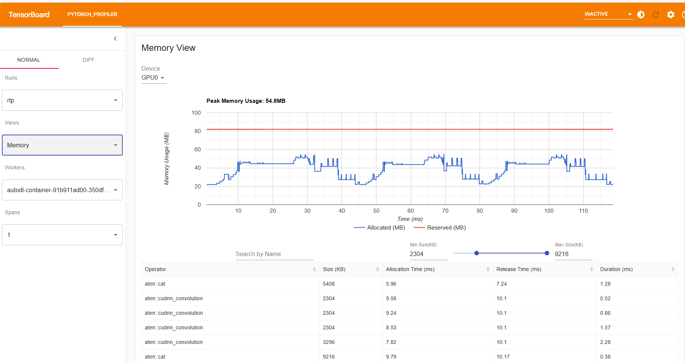
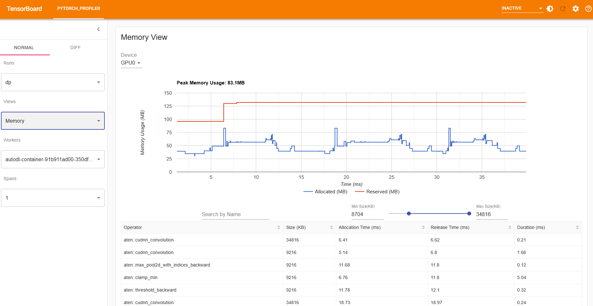
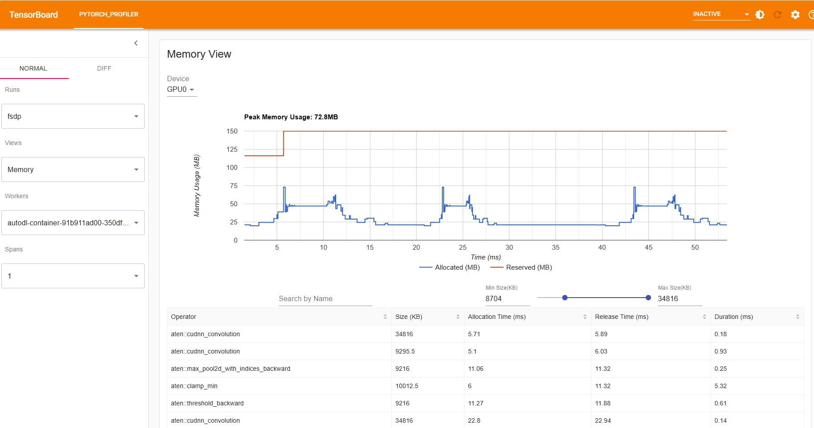

Getting Started with Rotated Tensor Parallel(RTP)
=====================================================

**Author**: `Cheng Luo <https://github.com/wdlctc>`

Training expansive neural network models demands significant computational resources and introduces engineering complexities. 
The introduction of Rotated Tensor Parallelism (RTP), as discussed in the paper titled "RTP: RETHINKING TENSOR PARALLELISM WITH MEMORY DEDUPLICATION", offers a solution to these challenges by focusing on memory deduplication in distributed training environments.

In this tutorial, we show how to use rtp, for a simple transform model which is been borrowed from `here <https://github.com/facebookresearch/fairscale/blob/main/benchmarks/models/transformer_lm.py>`__. 

This tutorial is written by referring `Getting Started with Fully Sharded Data Parallel(FSDP) <https://github.com/pytorch/tutorials/blob/main/intermediate_source/FSDP_tutorial.rst>`__. 

How RTP works
--------------
In `DistributedDataParallel <https://pytorch.org/docs/stable/generated/torch.nn.parallel.DistributedDataParallel.html>`__, (DDP) training, each process/ worker owns a replica of the model and processes a batch of data, finally it uses all-reduce to sum up gradients over different workers. In DDP the model weights and optimizer states are replicated across all workers. RTP is a type of Tensor parallelism that shards model parameters, gradients and activations across DDP ranks. 

Unlike traditional parallelism techniques, RTP introduces a unique approach that emphasizes memory deduplication in distributed training. At its core, RTP combines the "rotation primitive" with the Flyweight Memory Pattern, allowing for efficient sharding of both model parameters and activations. This not only reduces memory usage but also enhances training performance by ensuring a seamless overlap between computation and communication, eliminating idle GPU time.

When training with RTP, the GPU memory footprint is smaller than when training with DDP or FSDP across all workers. This makes the training of some very large models feasible by allowing larger models or batch sizes to fit on device. This comes with the cost of increased communication volume. The communication overhead is reduced by internal optimizations like overlapping communication and computation.

.. figure:: ../docs/img/RTP.png
   :width: 100%
   :align: center
   :alt: RTP workflow

   RTP Workflow

At a high level RTP works as follow:

*In constructor*

* Shard model parameters as Tensor Parallelism way and each rank only keeps its own shard

*In forward path*

* Run forward computation
* Run clockwise-rotation to rotate the parameter shards to the next rank, in overlapped mode with forward computation
* repeat forward computation and rotating parameters until all ranks have processed the forward pass

*In backward path*

* Run backward computation
* Run counter-clockwise rotation to rotate the parameters and gradients to the previous rank, in overlapped mode with backward computation
* repeat backward computation again and the rotating parameters and gradients until all ranks have processed the backward pass

How to use RTP
--------------
For demonstration purposes, we'll use a simple mnist model(see the `examples <https://github.com/wdlctc/rtp/blob/main/benchmarks/rtp_mnist.py>`_ for full training example):. 
RTP requires modifying the model definition. auto_wrap_policy is a developing feature in RTP currently.

*Setup*

1.1 Install from source

.. code-block:: bash 

    git clone https://github.com/wdlctc/rtp
    cd rtp
    pip install -r requirements.txt
    pip install -e .

We add the following code snippets to a python script “FSDP_mnist.py”.

1.2  Import necessary packages

.. note::
    This tutorial is intended for PyTorch versions 1.12 and later. If you are using an earlier version, replace all instances of `size_based_auto_wrap_policy` with `default_auto_wrap_policy`.

.. code-block:: python

    # Based on: https://github.com/pytorch/examples/blob/master/mnist/main.py
    import os
    import argparse
    import functools
    import torch
    import torch.nn as nn
    import torch.nn.functional as F
    import torch.optim as optim
    from torchvision import datasets, transforms

    from torch.optim.lr_scheduler import StepLR

    import torch.distributed as dist
    import torch.multiprocessing as mp
    from torch.nn.parallel import DistributedDataParallel as DDP
    from torch.utils.data.distributed import DistributedSampler
    from torch.distributed.fsdp import FullyShardedDataParallel as FSDP
    from torch.distributed.fsdp.fully_sharded_data_parallel import (
        CPUOffload,
        BackwardPrefetch,
    )
    from torch.distributed.fsdp.wrap import (
        size_based_auto_wrap_policy,
        enable_wrap,
        wrap,
    )

    from rtp.rotated_tensor_parallel import RotatedTensorParallel

1.3 Distributed training setup. As we mentioned RTP is a type of data parallelism which requires a distributed training environment, so here we use two helper functions to initialize the processes for distributed training and clean up.

.. code-block:: python

    def setup(rank, world_size):
        os.environ['MASTER_ADDR'] = 'localhost'
        os.environ['MASTER_PORT'] = '12355'

        # initialize the process group
        dist.init_process_group("nccl", rank=rank, world_size=world_size)

    def cleanup():
        dist.destroy_process_group()

2.1  Define our toy model for handwritten digit classification. 

.. code-block:: python

    class Net(nn.Module):
        def __init__(self):
            super(Net, self).__init__()
            self.conv1 = nn.Conv2d(1, 32, 3, 1)
            self.conv2 = nn.Conv2d(32, 64, 3, 1)
            self.dropout1 = nn.Dropout(0.25)
            self.dropout2 = nn.Dropout(0.5)
            self.fc1 = nn.Linear(9216, 128)
            self.fc2 = nn.Linear(128, 10)

        def forward(self, x):

            x = self.conv1(x)
            x = F.relu(x)
            x = self.conv2(x)
            x = F.relu(x)
            x = F.max_pool2d(x, 2)
            x = self.dropout1(x)
            x = torch.flatten(x, 1)
            x = self.fc1(x)
            x = F.relu(x)
            x = self.dropout2(x)
            x = self.fc2(x)
            output = F.log_softmax(x, dim=1)
            return output

2.2 Define a train function 

.. code-block:: python

    def train(args, model, rank, world_size, train_loader, optimizer, epoch, sampler=None):
        model.train()
        ddp_loss = torch.zeros(2).to(rank)
        if sampler:
            sampler.set_epoch(epoch)
        for batch_idx, (data, target) in enumerate(train_loader):
            data, target = data.to(rank), target.to(rank)
            optimizer.zero_grad()
            output = model(data)
            loss = F.nll_loss(output, target, reduction='sum')
            loss.backward()
            optimizer.step()
            ddp_loss[0] += loss.item()
            ddp_loss[1] += len(data)

        dist.all_reduce(ddp_loss, op=dist.ReduceOp.SUM)
        if rank == 0:
            print('Train Epoch: {} \tLoss: {:.6f}'.format(epoch, ddp_loss[0] / ddp_loss[1]))

2.3 Define a validation function 

.. code-block:: python

    def test(model, rank, world_size, test_loader):
        model.eval()
        correct = 0
        ddp_loss = torch.zeros(3).to(rank)
        with torch.no_grad():
            for data, target in test_loader:
                data, target = data.to(rank), target.to(rank)
                output = model(data)
                ddp_loss[0] += F.nll_loss(output, target, reduction='sum').item()  # sum up batch loss
                pred = output.argmax(dim=1, keepdim=True)  # get the index of the max log-probability
                ddp_loss[1] += pred.eq(target.view_as(pred)).sum().item()
                ddp_loss[2] += len(data)

        dist.all_reduce(ddp_loss, op=dist.ReduceOp.SUM)

        if rank == 0:
            test_loss = ddp_loss[0] / ddp_loss[2]
            print('Test set: Average loss: {:.4f}, Accuracy: {}/{} ({:.2f}%)\n'.format(
                test_loss, int(ddp_loss[1]), int(ddp_loss[2]),
                100. * ddp_loss[1] / ddp_loss[2]))

2.4 Define a distributed train function, note we recommand to warp model on cpu then transform it into GPU in order to save memory.

.. code-block:: python

    def rtp_main(rank, world_size, args):
        setup(rank, world_size)

        transform=transforms.Compose([
            transforms.ToTensor(),
            transforms.Normalize((0.1307,), (0.3081,))
        ])

        dataset1 = datasets.MNIST('../data', train=True, download=True,
                            transform=transform)
        dataset2 = datasets.MNIST('../data', train=False,
                            transform=transform)

        sampler1 = DistributedSampler(dataset1, rank=rank, num_replicas=world_size, shuffle=True)
        sampler2 = DistributedSampler(dataset2, rank=rank, num_replicas=world_size)

        train_kwargs = {'batch_size': args.batch_size, 'sampler': sampler1}
        test_kwargs = {'batch_size': args.test_batch_size, 'sampler': sampler2}
        cuda_kwargs = {'num_workers': 2,
                        'pin_memory': True,
                        'shuffle': False}
        train_kwargs.update(cuda_kwargs)
        test_kwargs.update(cuda_kwargs)

        train_loader = torch.utils.data.DataLoader(dataset1,**train_kwargs)
        test_loader = torch.utils.data.DataLoader(dataset2, **test_kwargs)
        my_auto_wrap_policy = functools.partial(
            size_based_auto_wrap_policy, min_num_params=100
        )
        torch.cuda.set_device(rank)
        
        
        init_start_event = torch.cuda.Event(enable_timing=True)
        init_end_event = torch.cuda.Event(enable_timing=True)

        model = Net()
        model = RotatedTensorParallel(model)
        model.cuda()

        optimizer = optim.Adadelta(model.parameters(), lr=args.lr)

        scheduler = StepLR(optimizer, step_size=1, gamma=args.gamma)
        init_start_event.record()
        for epoch in range(1, args.epochs + 1):
            train(args, model, rank, world_size, train_loader, optimizer, epoch, sampler=sampler1)
            test(model, rank, world_size, test_loader)
            scheduler.step()

        init_end_event.record()

        if rank == 0:
            print(f"CUDA event elapsed time: {init_start_event.elapsed_time(init_end_event) / 1000}sec")
            print(f"{model}")

        if args.save_model:
            # use a barrier to make sure training is done on all ranks
            dist.barrier()
            states = model.state_dict()
            if rank == 0:
                torch.save(states, "mnist_cnn.pt")
        
        cleanup()

2.5 Finally parse the arguments and set the main function

.. code-block:: python

    if __name__ == '__main__':
        # Training settings
        parser = argparse.ArgumentParser(description='PyTorch MNIST Example')
        parser.add_argument('--batch-size', type=int, default=64, metavar='N',
                            help='input batch size for training (default: 64)')
        parser.add_argument('--test-batch-size', type=int, default=1000, metavar='N',
                            help='input batch size for testing (default: 1000)')
        parser.add_argument('--epochs', type=int, default=10, metavar='N',
                            help='number of epochs to train (default: 14)')
        parser.add_argument('--lr', type=float, default=1.0, metavar='LR',
                            help='learning rate (default: 1.0)')
        parser.add_argument('--gamma', type=float, default=0.7, metavar='M',
                            help='Learning rate step gamma (default: 0.7)')
        parser.add_argument('--no-cuda', action='store_true', default=False,
                            help='disables CUDA training')
        parser.add_argument('--seed', type=int, default=1, metavar='S',
                            help='random seed (default: 1)')
        parser.add_argument('--save-model', action='store_true', default=False,
                            help='For Saving the current Model')
        args = parser.parse_args()

        torch.manual_seed(args.seed)

        WORLD_SIZE = torch.cuda.device_count()
        mp.spawn(rtp_main,
            args=(WORLD_SIZE, args),
            nprocs=WORLD_SIZE,
            join=True)

We have recorded cuda events to measure the time of RTP model specifics. The CUDA event time was 163 seconds.

.. code-block:: bash

    python rtp_mnist.py

    CUDA event elapsed time on training loop 163.019875sec

Using the model with rtp, the model will look as follows, we can see the model has use RTP unit.

.. code-block:: bash
    RotatedTensorParallel(
        (module): Net(
            (conv1): FlyweightWarpper(
                (module): Conv2d(1, 32, kernel_size=(3, 3), stride=(1, 1))
            )
            (conv2): FlyweightWarpper(
                (module): Conv2d(32, 64, kernel_size=(3, 3), stride=(1, 1))
            )
            (dropout1): Dropout(p=0.25, inplace=False)
            (dropout2): Dropout(p=0.5, inplace=False)
            (fc1): FlyweightWarpper(
                (module): Linear(in_features=9216, out_features=128, bias=True)
            )
            (fc2): FlyweightWarpper(
                (module): Linear(in_features=128, out_features=10, bias=True)
            )
        )
    )

The following is the peak memory usage from RTP MNIST training on 4 V100 GPUs captured from PyTorch Profiler. 

   RTP Peak Memory Usage

Compare it with DDP, if in 2.4 we need to use original and  wrap the model in DPP, saving the changes in "dp_mnist.py”.

.. code-block:: python

    model = Net().to(rank)
    model = DDP(model)

.. code-block:: bash

    python dp_mnist.py

    CUDA event elapsed time on training loop 113.7948671875sec

The following is the peak memory usage from DDP MNIST training on 4 V100 GPUs captured from PyTorch profiler. 

   DDP Peak Memory Usage using Auto_wrap policy

Compare it with FSDP, if in 2.4 we just normally wrap the model in DPP, saving the changes in “DDP_mnist.py”.

.. code-block:: python

    model = Net().to(rank)
    model = FSDP(model)

.. code-block:: bash

    python fsdp_mnist.py

    CUDA event elapsed time on training loop 116.180171875sec

The following is the peak memory usage from FSDP MNIST training on 4 V100 GPUs captured from PyTorch profiler. 

   FSDP Peak Memory Usage using Auto_wrap policy

Considering the toy example and tiny MNIST model we defined here, we can observe the difference between peak memory usage of RTP, DDP and FSDP. 
In DDP each process holds a replica of the model, so the memory footprint is higher compared to RTP which shards the model parameters, optimizer states and gradients over DDP ranks.
In FSDP each process need to reconstruct whole model/layer, so the memory footprint is higher compared to RTP which only need shard of model parameters, optimizer states.
The peak memory usage using RTP policy is the lowest followed by FSDP and DDP. 

This example does not represent most of the real applications, for detailed analysis and comparison between RTP, DDP and FSDP please refer to this `arxiv paper <https://arxiv.org/abs/2311.01635>`__ .